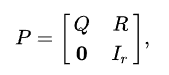

# 3.1. Doomsday Fuel

Making fuel for the LAMBCHOP's reactor core is a tricky process because of the exotic matter involved. It starts as raw ore, then during processing, begins randomly changing between forms, eventually reaching a stable form. There may be multiple stable forms that a sample could ultimately reach, not all of which are useful as fuel.

Commander Lambda has tasked you to help the scientists increase fuel creation efficiency by predicting the end state of a given ore sample. You have carefully studied the different structures that the ore can take and which transitions it undergoes. It appears that, while random, the probability of each structure transforming is fixed. That is, each time the ore is in 1 state, it has the same probabilities of entering the next state (which might be the same state). You have recorded the observed transitions in a matrix. The others in the lab have hypothesized more exotic forms that the ore can become, but you haven't seen all of them.

Write a function `answer(m)` that takes an array of array of nonnegative ints representing how many times that state has gone to the next state and return an array of ints for each terminal state giving the exact probabilities of each terminal state, represented as the numerator for each state, then the denominator for all of them at the end and in simplest form. The matrix is at most 10 by 10. It is guaranteed that no matter which state the ore is in, there is a path from that state to a terminal state. That is, the processing will always eventually end in a stable state. The ore starts in state 0. The denominator will fit within a signed 32-bit integer during the calculation, as long as the fraction is simplified regularly.

For example, consider the matrix m:

```
[
  [0,1,0,0,0,1],  # s0, the initial state,goes to s1 and s5 with equal probability
  [4,0,0,3,2,0],  # s1 can become s0, s3, or s4, but with different probabilities
  [0,0,0,0,0,0],  # s2 is terminal, and unreachable (never observed in practice)
  [0,0,0,0,0,0],  # s3 is terminal
  [0,0,0,0,0,0],  # s4 is terminal
  [0,0,0,0,0,0],  # s5 is terminal
]
```

So, we can consider different paths to terminal states, such as:
```
s0 -> s1 -> s3
s0 -> s1 -> s0 -> s1 -> s0 -> s1 -> s4
s0 -> s1 -> s0 -> s5
```
Tracing the probabilities of each, we find that:
```
s2 has probability 0
s3 has probability 3/14
s4 has probability 1/7
s5 has probability 9/14
```
So, putting that together, and making a common denominator, gives an answer in the form of `[s2.numerator, s3.numerator, s4.numerator, s5.numerator, denominator]` which is `[0, 3, 2, 9, 14]`.

---

# Explanation

Now it gets interesting. The input matrix `m` represents a *transition matrix*, describing the dynamics of a stochastic process as the ore moves between different states over (discrete) time steps. One with prior mathematics experience would identify a Markov Chain-like problem where the future state depends only on the current state and not on the sequence of events that preceded it [[1]](https://doi.org/10.1016/0010-4809(86)90049-2). Alternatively, one can watch [this video series](https://www.youtube.com/watch?v=i3AkTO9HLXo&ab_channel=NormalizedNerd) to fill in the blanks.

Subsequent research led me to uncover that this problem pertains to [Absorbing Markov Chains](https://math.libretexts.org/Bookshelves/Applied_Mathematics/Applied_Finite_Mathematics_(Sekhon_and_Bloom)/10%3A_Markov_Chains/10.04%3A_Absorbing_Markov_Chains), in which when a certain state is reached, it is impossible to leave that state [[2]](https://doi.org/10.1093/biomet/57.1.129). These states are known as *absorbing states*. In our narrative, however, such states are represented by the "stable" form of the ore -- wherein all other non-terminal forms are transient. One prime example that may be of help is [Gambler's Ruin](https://stats.libretexts.org/Bookshelves/Probability_Theory/Book%3A_Introductory_Probability_(Grinstead_and_Snell)/12%3A_Random_Walks/12.02%3A_Gambler's_Ruin), being an extension of Absorbing Markov Chains wherein two absorbing states are present: one representing the gambler reaching the target amount ('M') and another representing the gambler going bankrupt (reaching 0).

To standardise terminologies, consider an absorbing Markov chain with transition matrix `P` have `t` transient states and `r` absorbing states. Unlike a typical transition matrix, the rows of `P` represent sources, while columns represent destinations. Thereby its Canonical Form [[3]](https://doi.org/10.1080/0020739910220512) would be:



In this context:
* `Q` represents a matrix with dimensions `t`-by-`t`;
* `R` denotes a non-zero matrix with dimensions `t`-by-`r`;
* `0` stands for an `r`-by-`t` matrix of zeros;
* `Ir` signifies the `r`-by-`r` identity matrix. 

Consequently, matrix `Q` characterizes the likelihood of moving between transient states, while matrix `R` indicates the likelihood of moving from a transient state to an absorbing state.


After doing some reading, we therefore need to do the following:
1. Set list of transient and absorbing states. Note that there might be two or more of the latter.
2. Set empty list `res` to return results;
3. Make `R` and `Q` submatrix;
4. Make `I` submatrix
5. Inverse `(I - Q)`, set as fundamental matrix `F`.
6. Multiply matrices `F` against `R`, set as solution matrix `FR`.
7. Find common denominator from `FR[0]`
8. For each element in `FR`, find `(element * commonDenominator).numerator`
9. Append all to `res`, return `res`.


Notably, one particular standard library that helped a lot is `fractions`. Against the input matrix `m`, it converts each non-zero `int` to a `Fraction()` data type, where it can has multiple properties such as `limit_denominator()` and `as_integer_ratio()`. For me, `Fraction()` data type is very much easier to work with, especially when splitting the input matrix to its Canonical Form. Also, it is worth noting that in Python 2.7., the `math` standard library had not included the `gcd()` method. Such method is still in the `fractions` standard library -- so you might want to check your `gcd()` function when implementing LCM on your own.

I think... at this point of Google Foobar, modularity is a prominent notion to implement instead of dumping all of the code in one `solution()`. This led me to make a ton of helper functions, particularly since `numpy` functionalities are not allowed 🤦🏻‍♂️.

## References
[1] Jain, S. (1986). Markov chain model and its application. Computers and Biomedical Research, 19(4), 374-378.

[2] Matthews, J. P. (1970). A central limit theorem for absorbing Markov chains. Biometrika, 57(1), 129–139. 

[3] Theodore J. Sheskin (1991) Computing absorption probabilities for a Markov chain, International Journal of Mathematical Education in Science and Technology, 22:5, 799-805