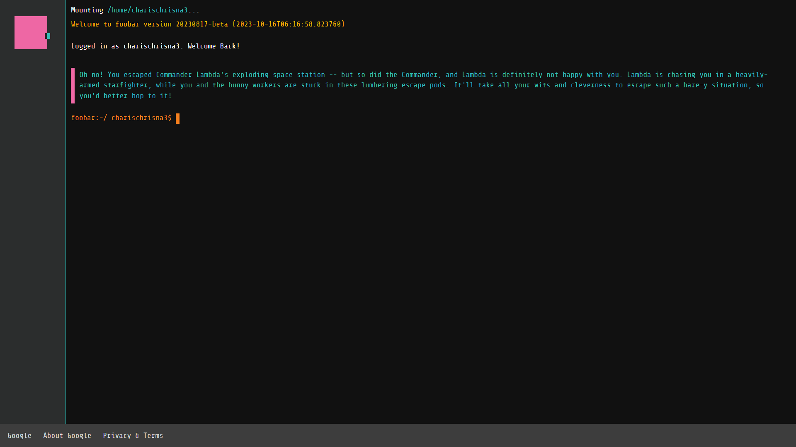

# Commander Lambda
Late 2020, I was invited to partake to the [Google Foobar challenge](https://www.geeksforgeeks.org/google-foo-bar-challenge/), a series of competitive programming-like challenges pertaining to CS fundamentals e.g., algorithms, data structures, and mathematics. The challenge consists of five levels, with each supposedly harder than the previous. Despite such allure, I only started the challenge in August 2022, and the idea of uploading this to GitHub didn't cross my mind until a more recent time.

The theme centres around a science fiction universe where we (the protagonist) have successfully infiltrated the spaceship of Commander Lambda, a malevolent warlord, as one of their minions. 
Our mission is to foil their plot in annihilating Bunny Planet, where we slowly advance through the hierarchy given that Minions hold the lowest position.

As for now, I have completed the first four levels, and shamelessly, indefinitely, procrastinating to commence the final one. This repository contains all my solutions and their theoretical underpinnings behind implementations.

